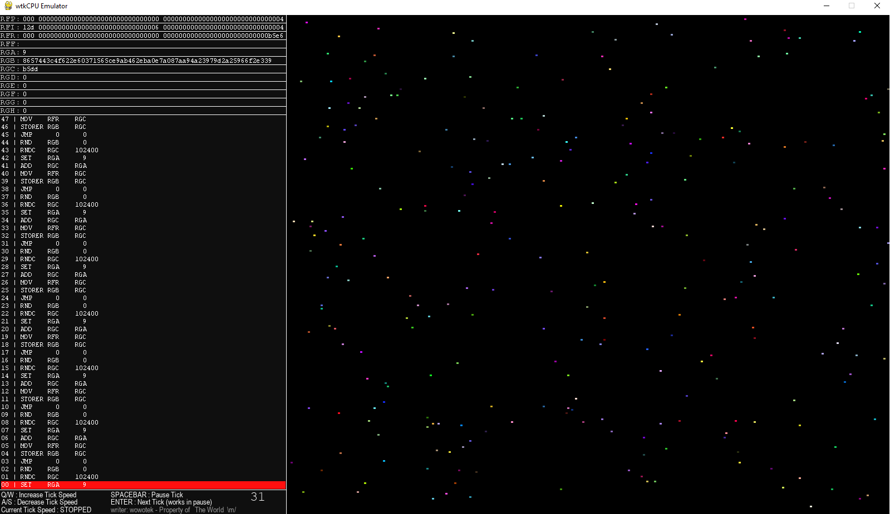

# wtkCPU



this is a fun project to emulate my own CPU

## Running Project

1. Clone this repo
2. (OPTIONAL) install and create virtualenv
    ```bash
    python -m pip install virtualenv
    virtualenv --always-copy venv
    source venv/bin/activate        # non-windows
    source venv/Scripts/activete    # linux
    ```
3. Compile your assembly (using `draw_random_pixel.asm` as example)
    ```bash
    python assembler draw_random_pixel.asm -o random_pixel.bin
    ```
4. Run Your Assembly Code
    ```bash
    python computer random_pixel.bin
    ```

## Descriptions

- 256 Bit Architecture
- Left-Most is Most Significant Bit
- Little-Endian
- 12 Registers, 8 General Purpose Registers
    - **RFP** : Instruction Pointer / Program Counter
    - **RFI** : Instruction
    - **RFR** : ALU Return
    - **RFF** : Flag Registers
        - bit 0 = Overflow
        - bit 1 = Zero
        - bit 2 = Negative
        - bit 3 = Carry
        - bit 4 = Underflow
    - **RGA** : General Purpose Register A
    - **RGB** : General Purpose Register B
    - **RGC** : General Purpose Register C
    - **RGD** : General Purpose Register D
    - **RGE** : General Purpose Register E
    - **RGF** : General Purpose Register F
    - **RGG** : General Purpose Register G
    - **RGH** : General Purpose Register H
- Instructions
    - **NOP**    : No Operation
    - **HALT**   : Halt Processor
    - **MOV**    : Copy Register Value SRC to Register DEST
    - **SET**    : set Register Value SRC to a Constant DEST
    - **MEMSET** : set RAM Address at SRC to a Constant DEST
    - **LOAD**   : load from RAM Address SRC to Register DEST
    - **STORE**  : store Register Value SRC to RAM Address Constant Dest
    - **LEA**    : ---NOT IMPLEMENTED---- NEED HELP
    - **RND**    : Randomize SRC until maximum number allowed by archlength
    - **RNDC**   : Randomize SRC until DEST
    - **RNDS**   : Signed Randomize SRC from -archlength/2 until +archlength/2
    - **STORER** : Store Register Value SRC to RAM Address at Register Value DEST
    - **JMP**    : Unconditional Jump
    - **JEZ**    : Jump if Zero
    - **JNE**    : Jump if Not Equal
    - **JMG**    : Jump if SRC is Greater than DEST
    - **JML**    : Jump if SRC is Less Than DEST
    - **OR**     : Logical SRC Or DEST
    - **NOR**    : Logical SRC NOr DEST
    - **AND**    : Logical SRC And DEST
    - **NAND**   : Logical SRC NAND DEST
    - **XOR**    : Logical SRC XOR DEST
    - **XNOR**   : Logical SRC XNOR DEST
    - **INC**    : Increment SRC
    - **DEC**    : Decrement SRC
    - **ADD**    : SRC + DEST
    - **SUB**    : SRC - DEST
    - **MUL**    : SRC * DEST
    - **DIV**    : SRC / DEST
    - **CMP**    : Set Flags appropriately based on SRC - DEST


